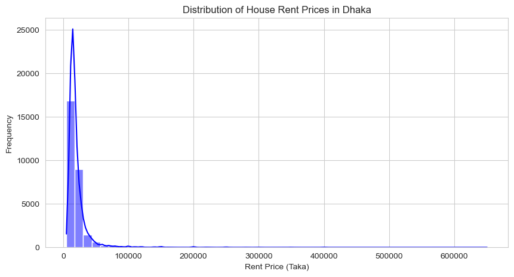
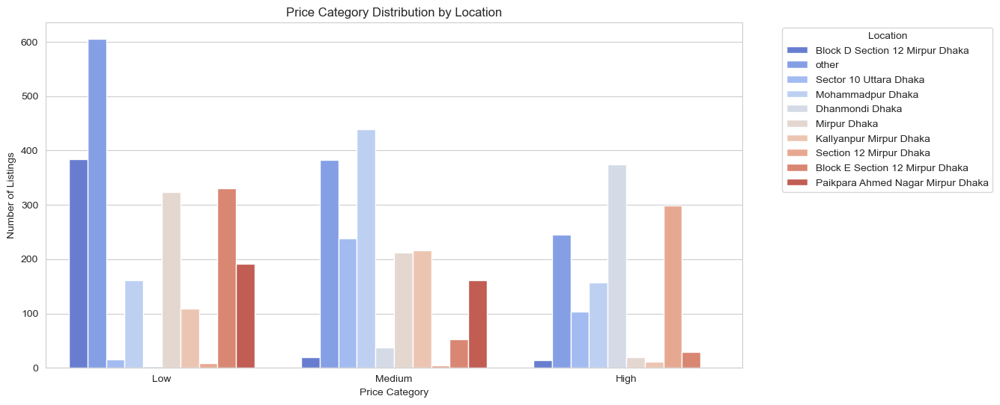
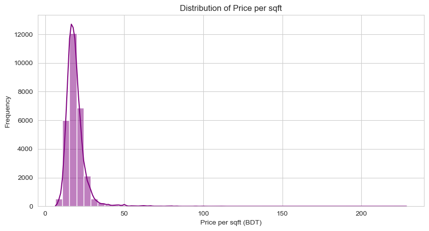
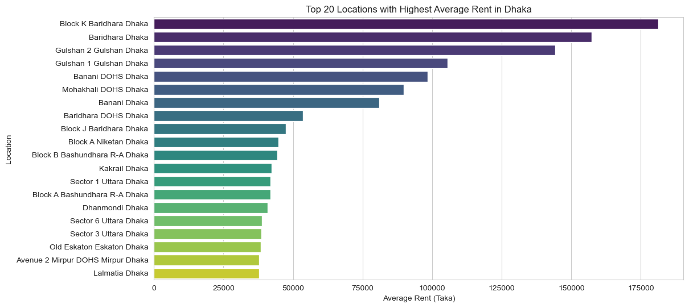
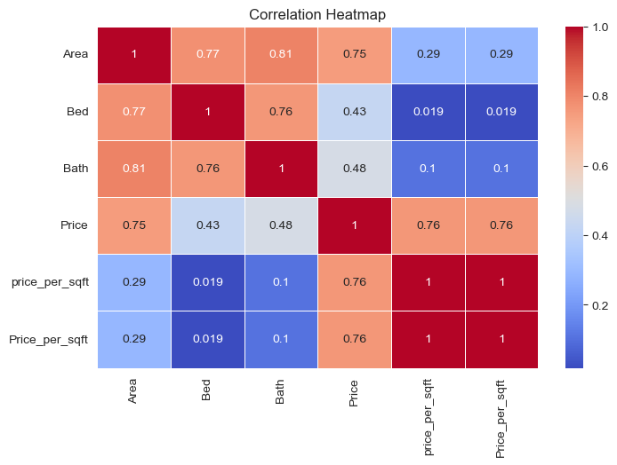
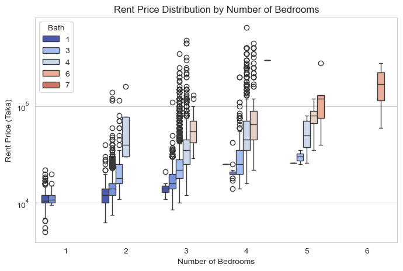
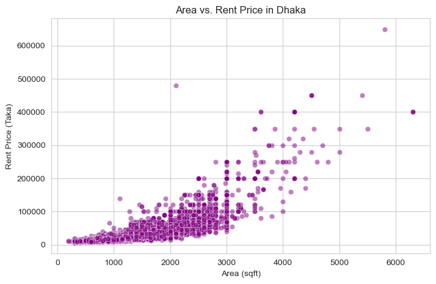
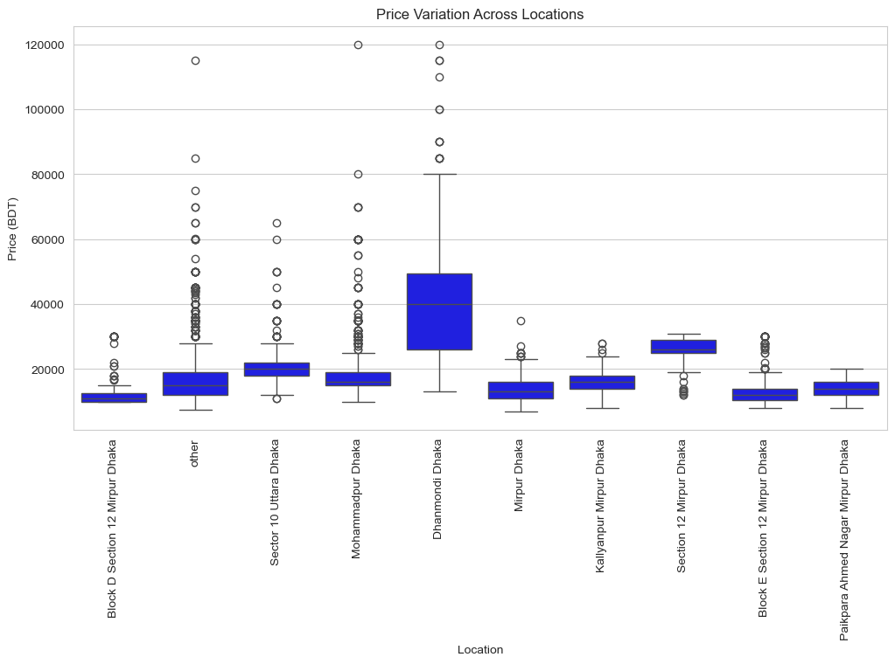
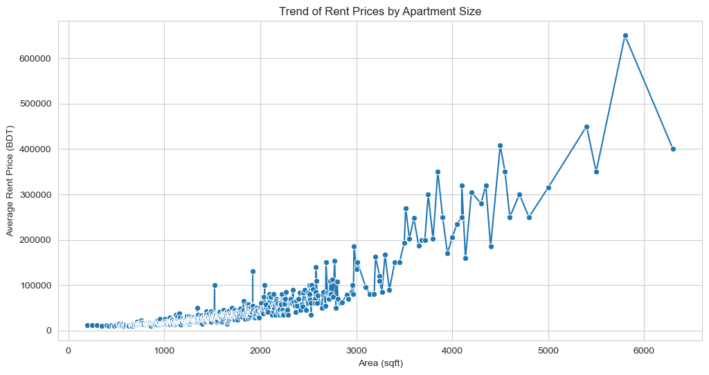
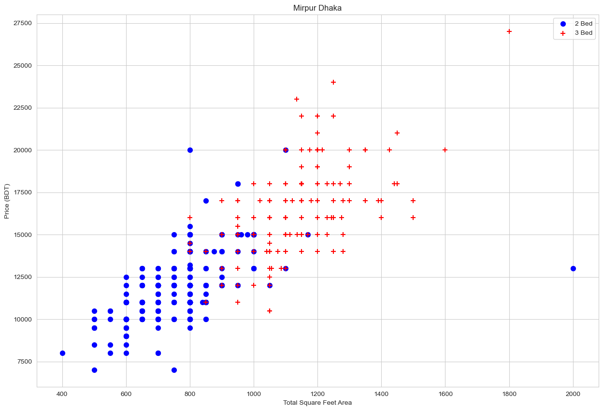

# House Price Prediction
---
### 🎯 Live Demo
#### *You can check out the live demo of the deployed project here:*
🔗 [Live Demo Link](https://arifhossainrumi.github.io/) 
---
## 📌 Project Overview
The House Price Prediction project aims to analyze rental prices in Dhaka and build a machine learning model to predict house prices based on various features. The project follows a structured approach that includes data collection, preprocessing, exploratory data analysis, model development, and deployment using a Flask API.

## 📊 Data Source
The dataset used in this project is sourced from `houserentdhaka.csv`, which contains rental listings in Dhaka. The dataset includes essential features such as:
- Location
- Area (sqft)
- Number of bedrooms
- Number of bathrooms
- Rental price

## 🔍 Data Cleaning & Preprocessing
To ensure high-quality data, several preprocessing steps were performed:
- 🗑 **Removing unnecessary columns**: Dropped the index column (`Unnamed`).
- ❌ **Handling missing values**: Checked for null values and handled them appropriately.
- 🔢 **Feature engineering**:
  - Converted `Area` from a string format to numerical (removing ‘sqft’ and commas).
  - Extracted numerical values from `Price` for easier computation.
- ⚠ **Filtering outliers**: Analyzed and filtered unusual values for `Bed` and `Bath`.

## 📈 Exploratory Data Analysis (EDA)
Exploratory Data Analysis (EDA) was performed to better understand the dataset and uncover patterns that influence rental prices in Dhaka. By analyzing different attributes, trends and relationships between factors such as location, area, and price were identified. 

**The following EDA steps were carried out:**

- House Rent Price Distribution
- Price Categories by Location
- Price per Square Foot Distribution
- Dhaka Rental Market Insights
- Real Estate Correlation Analysis 
- Rent Price Distribution Analysis
- Area vs. Rent Price in Dhaka
- Price Variation Across Locations in Dhaka
- Trend of Rent Prices by Apartment Size
- House Rent Analysis - Mirpur, Dhaka
 
---


### 1️⃣ **House Rent Price Distribution**
#### 📜 Code:
```python
sns.set_style("whitegrid")

# Plot distribution of house rent prices
plt.figure(figsize=(10, 5))
sns.histplot(df1["Price"], bins=50, kde=True, color="blue")
plt.xlabel("Rent Price (Taka)")
plt.ylabel("Frequency")
plt.title("Distribution of House Rent Prices in Dhaka")
plt.show()
```

#### 🖼️ Visualization:


#### 🚀 Key Insights  
- Most house rents in Dhaka are concentrated in the lower range.  
- Prices drop sharply after `100,000 Taka`, with very few homes priced over `300,000 Taka`.  

#### 🔍 **Key Takeaways:**  
- **Affordable housing dominates** the market.  
- **Limited high-end rentals** suggest a potential market gap.  

---

### 2️⃣ **Price Categories by Location**
#### 📜 Code:
```python
plt.figure(figsize=(12, 6))
top_locations = df1["Location"].value_counts().index[:10]  # Select top 10 locations
sns.countplot(data=df1[df1["Location"].isin(top_locations)], x=df1["Price_Category"], hue="Location", palette="coolwarm")
plt.xlabel("Price Category")
plt.ylabel("Number of Listings")
plt.title("Price Category Distribution by Location")
plt.legend(title="Location", bbox_to_anchor=(1.05, 1), loc="upper left")
plt.show()
```

#### 🖼️ Visualization:


#### 🚀 Key Insights 
- **Block D, Mirpur** and **Sector 10, Uttara** are budget-friendly zones with many low-priced listings.  
- **Dhanmondi** and **Mohammadpur** offer more medium to high-priced rentals.  
- Luxury rentals are rare but present in **Dhanmondi** and **Paikpara Ahmed Nagar Mirpur**.  

#### 🔍 **Key Takeaways:**  
- **Affordable zones:** Mirpur and Uttara dominate the budget-friendly market.  
- **Premium potential:** Dhanmondi shows demand for upscale housing.  

---

### 3️⃣ **Price per Square Foot Distribution**

#### 📜 Code:
```python
df1["Price_per_sqft"] = df1["Price"] / df1["Area"]

plt.figure(figsize=(10, 5))
sns.histplot(df1["Price_per_sqft"], bins=50, kde=True, color="purple")
plt.xlabel("Price per sqft (BDT)")
plt.ylabel("Frequency")
plt.title("Distribution of Price per sqft")
plt.show()
```

#### 🖼️ Visualization:


#### 🚀 Key Insights 
- Most homes in Dhaka have rent prices below `50 BDT per square foot`.  
- Prices above `100 BDT per square foot` are rare, indicating limited premium listings.  

#### 🔍 **Key Takeaways:**  
- **Rent prices are generally affordable**, with fewer high-end properties available.  

---

### 4️⃣ Dhaka Rental Market Insights

#### 📜 Code:
```python
# Group by Location and calculate average rent
location_rent = df1.groupby("Location")["Price"].mean().sort_values(ascending=False).head(20)  # Top 20 locations

# Plot average rent per location
plt.figure(figsize=(12, 6))
sns.barplot(x=location_rent.values, y=location_rent.index, hue=location_rent.index, palette="viridis")
plt.xlabel("Average Rent (Taka)")
plt.ylabel("Location")
plt.title("Top 20 Locations with Highest Average Rent in Dhaka")
plt.show()
```

#### 🖼️ Visualization:


#### 🚀 Key Insights  
- 🏡 **Most Expensive Areas:** Baridhara (Block K & J), Gulshan (1 & 2), and DOHS (Banani, Mohakhali, Baridhara) dominate high-end rentals.  
- 💰 **Luxury Rent Gap:** Top areas exceed **100,000 Taka**, while others drop significantly.  
- 📉 **Mid-Tier Options:** Dhanmondi, Uttara, and Kakrail offer premium but more affordable rents.  

#### 🔍 Key Takeaways  
✅ **Baridhara & Gulshan = Ultra-Luxury Living**  
✅ **DOHS Areas = High-End but Slightly Cheaper**  
✅ **Dhanmondi & Uttara = Affordable Premium Choices**  

---

### 5️⃣ Real Estate Correlation Analysis  

#### 📜 Code:
```python
plt.figure(figsize=(8, 5))

# Before creating the correlation heatmap, drop non-numeric columns like Location.
# Selecting only numeric columns
numeric_df = df1.select_dtypes(include=["number"])

sns.heatmap(numeric_df.corr(), annot=True, cmap="coolwarm", linewidths=0.5)
plt.title("Correlation Heatmap")
plt.show()
```

#### 🖼️ Visualization:


#### 🚀 Key Insights  
- 🏡 **Area, Bedrooms, and Bathrooms** are highly correlated (**0.75 - 0.81**) with **Price**, meaning bigger homes tend to cost more.  
- 🔄 **Price per Sqft is weakly correlated with Area, Beds, and Baths** but strongly linked to **Price (0.76)**.  

#### 🔍 Key Takeaways  
✅ **Larger Homes = Higher Prices**  
✅ **Price per Sqft drives overall pricing**   

---

### 6️⃣ Rent Price Distribution Analysis by Number of Bedrooms

#### 📜 Code:
```python
# Plot number of bedrooms vs. rent price
plt.figure(figsize=(8, 5))
sns.boxplot(x=df1["Bed"], y=df1["Price"], hue=df1["Bath"], palette="coolwarm")
plt.xlabel("Number of Bedrooms")
plt.ylabel("Rent Price (Taka)")
plt.title("Rent Price Distribution by Number of Bedrooms")
plt.yscale("log")  # Apply log scale for better visualization
plt.show()
```

#### 🖼️ Visualization:


#### 🚀 Key Insights  
- 🏡 **More Bedrooms = Higher Rent:** Rent generally increases with the number of bedrooms.  
- 🛁 **Bathrooms Impact Rent:** Higher bath counts (4, 6, 7) tend to have higher median rents.  
- 🎯 **Wide Price Range:** Rent prices show significant variation, with many outliers, especially for 3-4 bedroom units.  
- ⚠ **Luxury Segment:** Properties with **6+ bedrooms & 7 baths** have the highest rent, indicating a niche high-end market.  

#### 🔍 Key Takeaways  
✅ **Larger Homes = Higher Rent**  
✅ **More Bathrooms Add Value**  
✅ **High Variability = Diverse Rental Market**  

---

### 7️⃣ Area vs. Rent Price in Dhaka

#### 📜 Code:
```python
# Scatter plot for Area vs. Rent Price
plt.figure(figsize=(8, 5))
sns.scatterplot(x=df1["Area"], y=df1["Price"], alpha=0.5, color="purple")
plt.xlabel("Area (sqft)")
plt.ylabel("Rent Price (Taka)")
plt.title("Area vs. Rent Price in Dhaka")
plt.show()
```

#### 🖼️ Visualization:


#### 🚀 Key Insights
- 📏 **Bigger Space = Higher Rent:** Larger apartments generally have higher rent prices.
- 📈 **Positive Correlation:** The trend shows that as area (sqft) increases, rent also rises.
- 🎯 **High Rent Variability:** Even for similar-sized properties, rent prices vary widely.
- ⚠ **Luxury Segment:** Some large properties (4000+ sqft) command extremely high rents, indicating a premium market.

#### 🔍 Key Takeaways
- ✅ **More Space Costs More**
- ✅ **Rent Prices Aren’t Fixed—They Fluctuate**
- ✅ **Luxury Properties Drive Up the Market**

---

### 8️⃣ Price Variation Across Locations in Dhaka

#### 📜 Code:
```python
plt.figure(figsize=(12, 6))
top_locations = df1["Location"].value_counts().index[:10]  # Select top 10 locations
sns.boxplot(data=df1[df1["Location"].isin(top_locations)], x="Location", y="Price",color="blue")
plt.xticks(rotation=90)
plt.xlabel("Location")
plt.ylabel("Price (BDT)")
plt.title("Price Variation Across Locations")
plt.show()
```

#### 🖼️ Visualization:


#### 🚀 Key Insights
- 🏙 **Location Matters:** Rent prices vary significantly based on location.
- 📉 **Median Rent Differences:** Some areas have consistently lower median rents, while others, like Dhanmondi, show much higher price ranges.
- 🎯 **High Outliers:** Several locations exhibit extreme price outliers, especially in upscale areas.
- ⚖ **Price Dispersion:** Even within the same area, rent prices fluctuate, indicating diverse property options.

#### 🔍 Key Takeaways
- ✅ **Location Strongly Affects Rent**
- ✅ **Upscale Areas Have Higher Price Variability**
- ✅ **Extreme Outliers Exist in Premium Markets**

---

### 9️⃣ Trend of Rent Prices by Apartment Size

#### 📜 Code:
```python
area_groups = df1.groupby("Area")["Price"].mean().sort_index()

plt.figure(figsize=(12, 6))
sns.lineplot(x=area_groups.index, y=area_groups.values, marker="o")
plt.xlabel("Area (sqft)")
plt.ylabel("Average Rent Price (BDT)")
plt.title("Trend of Rent Prices by Apartment Size")
plt.show()
```

#### 🖼️ Visualization:


## 🚀 Key Insights
- 📈 **Larger Apartments = Higher Rent:** Rent prices tend to increase as apartment size grows.
- 🔄 **Fluctuations in High-End Market:** While the general trend is upward, there are fluctuations in larger apartments, suggesting variability in luxury pricing.
- 🎯 **Steep Price Growth:** Beyond 3000 sqft, rent prices rise significantly, with some extreme spikes for premium properties.
- ⚠ **Outliers in Large Apartments:** Some luxury apartments show rent prices that deviate far above the average trend.

#### 🔍 Key Takeaways
- ✅ **Bigger Apartments Have Higher Rent**
- ✅ **Luxury Market Shows High Price Variability**
- ✅ **Steep Rent Growth Beyond 3000 sqft**

---

##### 🔟 House Rent Analysis - Mirpur, Dhaka
#### 📜 Code:
```python
def plot_scatter_chart(df,Location):
    bed2 = df1[(df1.Location==Location) & (df1.Bed==2)]
    bed3 = df1[(df1.Location==Location) & (df1.Bed==3)]
    matplotlib.rcParams['figure.figsize'] = (15,10)
    plt.scatter(bed2.Area,bed2.Price,color='blue',label='2 Bed', s=50)
    plt.scatter(bed3.Area,bed3.Price,marker='+', color='red',label='3 Bed', s=50)
    plt.xlabel("Total Square Feet Area")
    plt.ylabel("Price (BDT)")
    plt.title(Location)
    plt.legend()
    plt.show()

plot_scatter_chart(df3,"Mirpur Dhaka")
```

#### 🖼️ Visualization:


#### 🚀 Key Insights 
This visualization shows rental prices in Mirpur, Dhaka, based on apartment size (square feet) and the number of bedrooms.

- 🏡 Rent Increases with Size – Larger apartments generally have higher rent prices.
- 🛏️ 2-Bed vs. 3-Bed Trends – 3-bedroom apartments (red) tend to have higher prices than 2-bedroom ones (blue).
- 📊 Dense Clusters at 600-1000 sqft – Most 2-bedroom apartments fall within this range, while 3-bedroom ones are more spread out.
- 📈 Higher Variability in Larger Apartments – Rent prices vary significantly for bigger apartments, indicating diverse pricing factors.

#### 🔍 Key Takeaways
- ✅ Larger Apartments Cost More
- ✅ 3-Bedroom Flats Are Generally Pricier
- ✅ Rent Prices Are More Predictable for Smaller Units
- ✅ Pricing for Larger Apartments Is Less Consistent

---


## 🤖 Model Development
A machine learning model was developed using **Linear Regression** to predict house prices:
- 🔀 **Data Splitting**: The dataset was divided into training and test sets.
- 📡 **Algorithm Selection**: Linear Regression was chosen as the primary model.
- 🎯 **Model Training**: The model was trained using `train_test_split` from Scikit-learn.
- 📊 **Evaluation Metrics**:
  - Mean Absolute Error (MAE)
  - R-squared score
- 🎯 Model Accuracy: The Linear Regression model achieved an accuracy of 91.61%.

## 🚀 Deployment Using Flask API
To make the model accessible, a **Flask API** was developed:
- 🌐 **Creating Endpoints**: The API allows users to input property details and get a predicted price.
- 🔄 **Integration**: The trained model was loaded using `joblib`.
- ☁ **Hosting**: The API has been tested locally and deployed using Render & GitHub host.


## 📌 Recommendations
Based on the analysis and model performance, the following recommendations are made:
- 📊 **Enhancing Data Quality**: More diverse and up-to-date data can improve accuracy.
- 🔍 **Feature Expansion**: Including additional features like neighborhood amenities or building age.
- 🏆 **Alternative Models**: Trying advanced models such as **Random Forest** or **Gradient Boosting** for better predictions.

## 🛠 Technical Tools Used
The following tools and technologies were used in this project:
- 💻 **Programming Language**: Python
- 📚 **Libraries**: Pandas, NumPy, Scikit-learn, Matplotlib, Seaborn
- 🤖 **Machine Learning Model**: Linear Regression
- 🌍 **Web Framework**: Flask, Flutter
- 📦 **Deployment**: Joblib for model persistence, Flask for API development, Render & Github for Hosting

---


